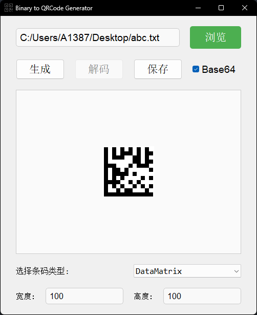

# Lab2QRCode

**Lab2QRCode** 是一款 Windows 平台下的工具，支持将**任意二进制或文本文件**转换为多种**条码图片**，以及将**条码图片**解码回原始文件。



## 特性

- 🔄 **双向转换**：支持文件到条码的编码，以及条码到文件的解码
- 📊 **多格式支持**：支持生成和识别多种一维码和二维码格式
- 🔒 **数据安全**：通过 Base64 编码确保特殊字符的正确处理
- 🖼️ **图像支持**：兼容常见图像格式
- 🎯 **用户友好**：简洁的图形界面操作简单

## 构建

使用 `cmake` 管理项目，依赖项：

- **[`zxing-cpp`](https://github.com/zxing-cpp/zxing-cpp)** - 条码处理核心库
- **`OpenCV4`** - 图像处理
- **`Qt5`** - 图形界面
- [**`mqtt5`**](https://github.com/boostorg/mqtt5) - 消息订阅
- [**`Boost.Asio`**](https://www.boost.org/doc/libs/master/doc/html/boost_asio.html)

使用 Visual Studio 17 工具链构建：

```cmake
git clone https://gitee.com/Mq-b/Lab2QRCode
mkdir build
cd build
cmake ..
cmake --build . -j --config Release
```

构建完成后，在 `build\Release\bin\` 目录下会生成 `Lab2QRCode.exe` 可执行文件。

## 支持的条码格式

Lab2QRCode 支持以下多种条码格式的生成和识别：

| 条码类型 | 格式名称 | 类别 | 特点 |
|---------|----------|------|------|
| **QR Code** | QRCode | 二维码 | 高容量、快速读取 |
| **Micro QR Code** | MicroQRCode | 二维码 | 小型QR码变体 |
| **rMQR Code** | RMQRCode | 二维码 | 矩形微QR码 |
| **Aztec Code** | Aztec | 二维码 | 不需要留白边 |
| **Data Matrix** | DataMatrix | 二维码 | 小尺寸标识 |
| **PDF417** | PDF417 | 二维码 | 堆叠式线性码 |
| **MaxiCode** | MaxiCode | 二维码 | 货运包裹使用 |
| **EAN-13** | EAN13 | 一维码 | 商品零售 |
| **EAN-8** | EAN8 | 一维码 | 小型商品 |
| **UPC-A** | UPCA | 一维码 | 北美商品 |
| **UPC-E** | UPCE | 一维码 | UPC压缩格式 |
| **Code 128** | Code128 | 一维码 | 高密度字符集 |
| **Code 39** | Code39 | 一维码 | 字母数字支持 |
| **Code 93** | Code93 | 一维码 | Code39增强版 |
| **Codabar** | Codabar | 一维码 | 血库、图书馆 |
| **ITF** | ITF | 一维码 | 交插二五码 |
| **DataBar** | DataBar | 一维码 | 原RSS码 |
| **DataBar Expanded** | DataBarExpanded | 一维码 | 扩展数据容量 |
| **DataBar Limited** | DataBarLimited | 一维码 | 有限字符集 |
| **DX Film Edge** | DXFilmEdge | 一维码 | 电影胶片边码 |

## 数据完整性保障

为确保兼容性，程序在生成条码前会对数据进行 **Base64 编码**，在解码时再进行 **Base64 解码**（可手动取消）。这样可以避免控制字符等特殊字符影响数据的正确性，确保转换过程中的数据完整性。

如果你希望在自己的项目中使用 `Base64` 编解码功能，可以参考本项目中的实现，具体代码见 [`SimpleBase64.h`](./include/SimpleBase64.h)。

## 使用说明

### 将文件转换为条码

1. 点击"**选择文件**"按钮选择要转换的源文件
2. 在格式列表中选择所需的条码格式
3. 点击"**生成条码**"按钮生成条码图片
4. 保存生成的条码图像文件

### 从条码图片还原文件

1. 点击"**浏览**"按钮选择一个条码图片文件
2. 程序会自动识别条码类型并解码
3. 选择保存路径后会将条码还原为原始文件

## 技术实现

基于 **ZXing-cpp** 库实现条码的编码和解码功能，该库是一个开源的、多格式的一维/二维条码图像处理库，支持多种条码格式的读写操作。

## 许可证

本项目采用 [MIT](./LICENSE) 开源许可证。